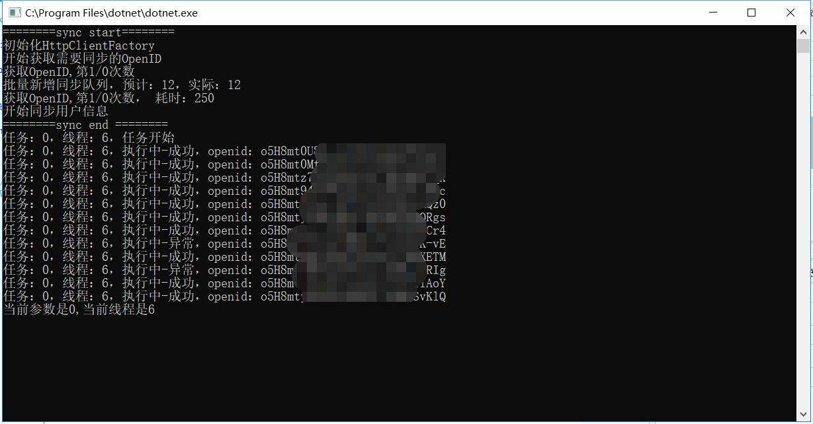

### 多线程备份微信用户信息

.net core 多线程同步微信用户数据

#### 技术
* freesql orm   
* ThreadPool  
* memcached   
* HttpClientFactory  

### 配置

>dbtype : 数据库类型
>
>connectionString：对应连接连接字符串
>
>这里要主要切换数据库需要添加对应freesql库，也可以应用完整引用所用Freesql.Provider.Sqlite、Freesql.Provider.SqlServer、Freesql.Provider.Oracle...... 
>
>wechat 微信对应的appid和secret配置
>
>setting里面ThreadPoolCount设置同时开启连接池的数量

#### 截图

### 多开情况如下

### 完成导入

